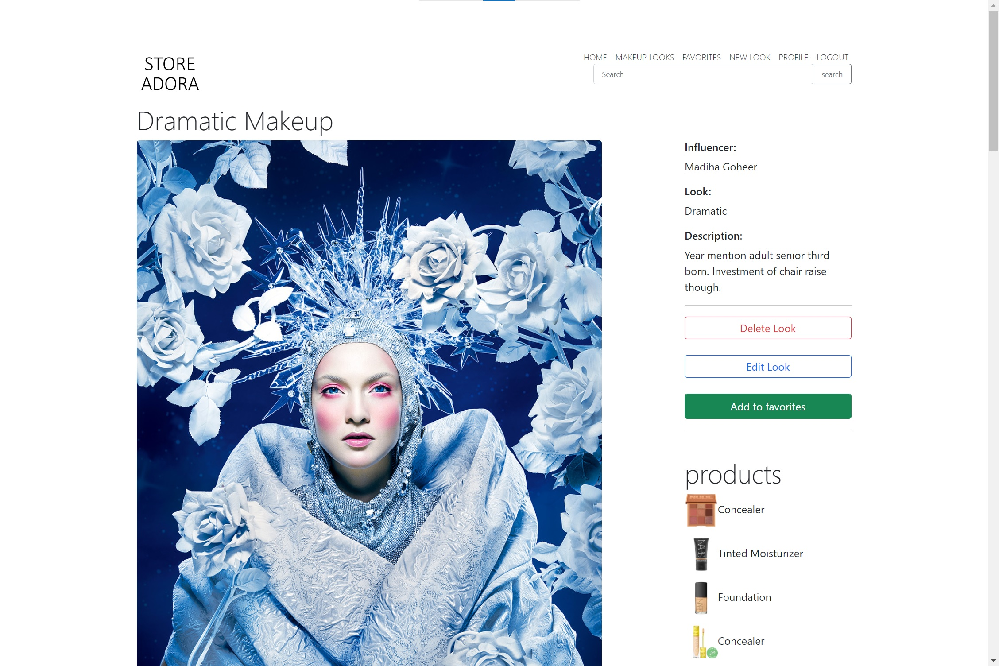

# StoreAdora

## Overview

StoreAdora, a visual platform,  enables users to learn and share different makeup looks. Users can browse through many looks created by the influencers. Along with that, they can see what products were used in those looks and where to buy them.

This web application is a fully functional web application which allows user to register, login/logout, create new posts, add new products, manage favorites, edit profile, search and much more.

When you open the web application you are presented with top looks created by the influencers. You can then continue browsing through the website as an anonymous user, or you can sign-up/login to get an enhanced experience. When you are logged in you get much more options such as the ability to create a new look, add looks to your favorites, add new products, and comment on posts.


## Demo

[](https://www.youtube.com/watch?v=WZE2Jo0jE3c "Final Project")


## Technologies required (besides typical Hackbright tech stack)
- Python
  - Jinja
  - Flask
  - FlaskForms
  - Pillow
  - SQLAlchemy
  - Faker
- PostgreSQL
- HTML
- Javascript
- AJAX
- Bootstrap


## Screenshots





## DataModel
- User email, password, name
- User's insta_handle & bio
- Product tile, description and website link
- Makeup title, description and makeup type
- Favorites


## Roadmap

#### 3.0 (current)
- Complete Sample Data
- Bootstrap + CSS Styling
- Full text search
- Comments add/delete.
- Form validation with FlaskForm

#### 2.0
- Update the UI
- User can comment on post.
- Use AJAX to set/get Favorite for better experience.
- Use AJAX to search and select products for new look.

#### MVP (1.0)
- Users can view categories of makeup looks.
- Users can login/ logout.
- Users can create their own account.
- Users can create posts.
- Uers can upload photos and add product descrption.
- Users can click on the website link of each product.
- User can have favorite posts.
- Users can Edit their profile, add profile picture edit their personal information.

# How to Run
## Setup
```
pip3 install -r requirements.txt
```
## Initialize Sample Data
```
python3 sampledata.py
```
## Run
```
python3 server.py
```
